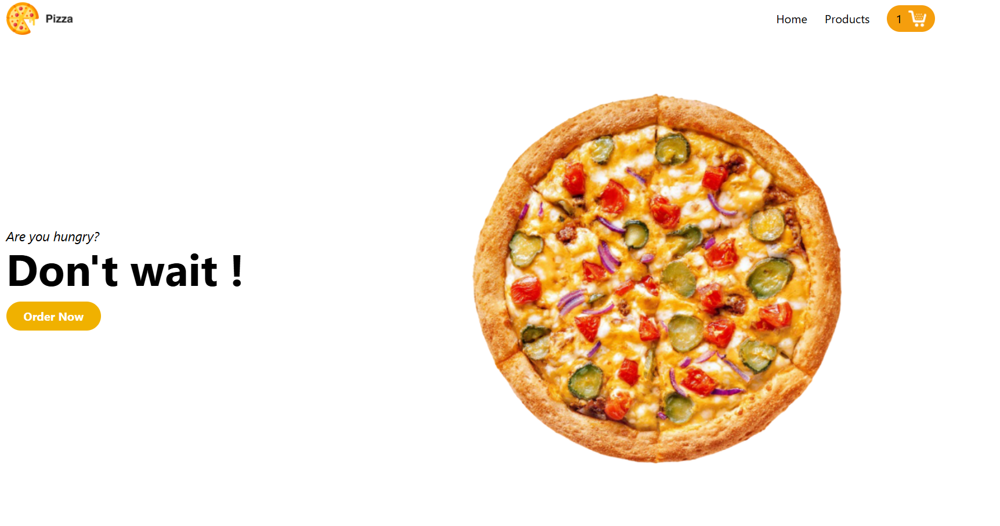
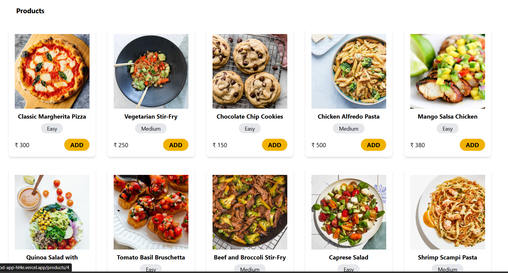
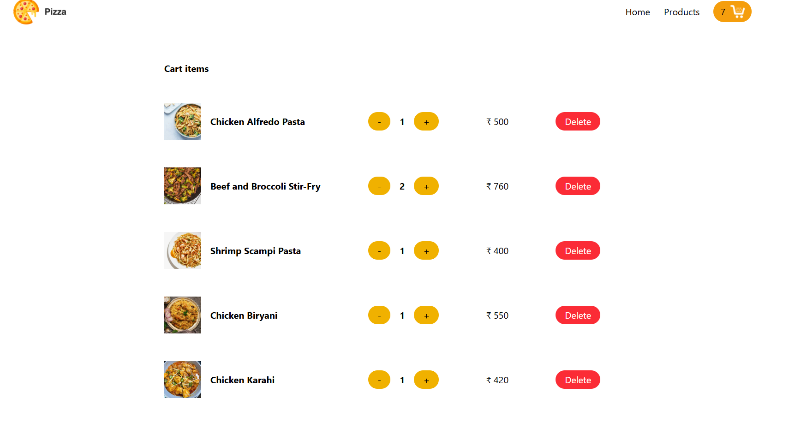
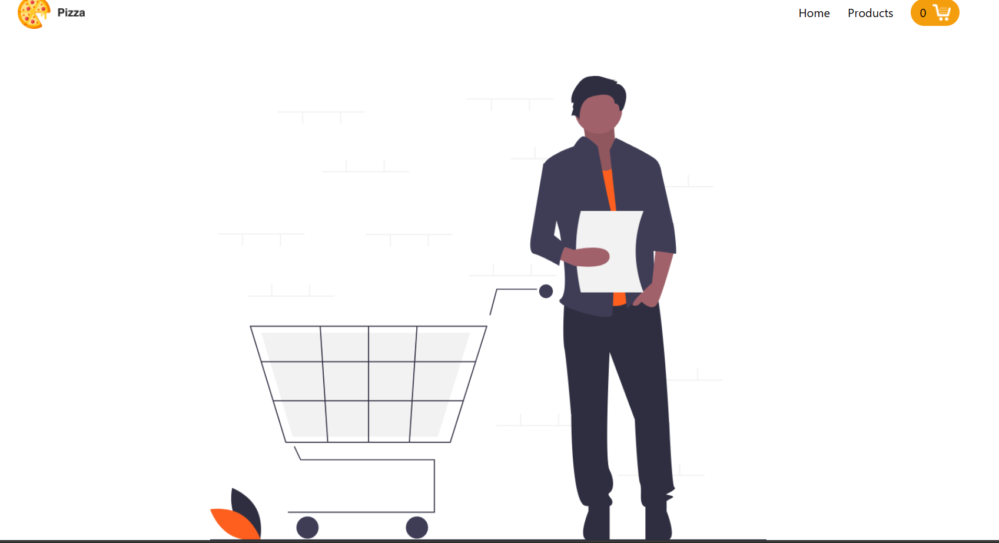

🍕 Vimal Food Pizza - React Shopping Cart App

A fully functional and beautifully designed React Pizza Cart Application built with Context API, Tailwind CSS, and live toast notifications. Includes cart persistence via localStorage and dynamic product fetching from API.

Preview:

🚀 Features
✅ Dynamic Pizza Recipes from https://dummyjson.com/recipes
✅ Add to Cart with quantity counter
✅ LocalStorage persistence for cart
✅ Toast notifications on Add / Order
✅ Product Detail View via React Router
✅ Quantity Increment / Decrement
✅ Remove individual items from cart
✅ Grand Total calculation
✅ "Order Now" functionality (clears cart)
✅ Fully responsive (TailwindCSS)
⚙️ Tech Stack
Frontend	Styling	State Management	Routing	Data Source
React.js	Tailwind CSS	Context API	React Router	DummyJSON API
🧱 Folder Structure

vimal-food-pizza/
├── public/
│   ├── images/
│   │   └── screenshot.png      # App preview image
│   └── index.html
├── src/
│   ├── components/
│   │   ├── Toast/
│   │   │   ├── Toast.css
│   │   │   └── Toast.js
│   │   ├── Navigation.js
│   │   ├── Product.js
│   │   └── Products.js
│   ├── pages/
│   │   ├── Cart.js
│   │   ├── Home.js
│   │   ├── ProductsPage.js
│   │   └── SingleProduct.js
│   ├── CartContext.js
│   ├── App.js
│   ├── App.css
│   └── index.js
├── package.json
└── README.md
